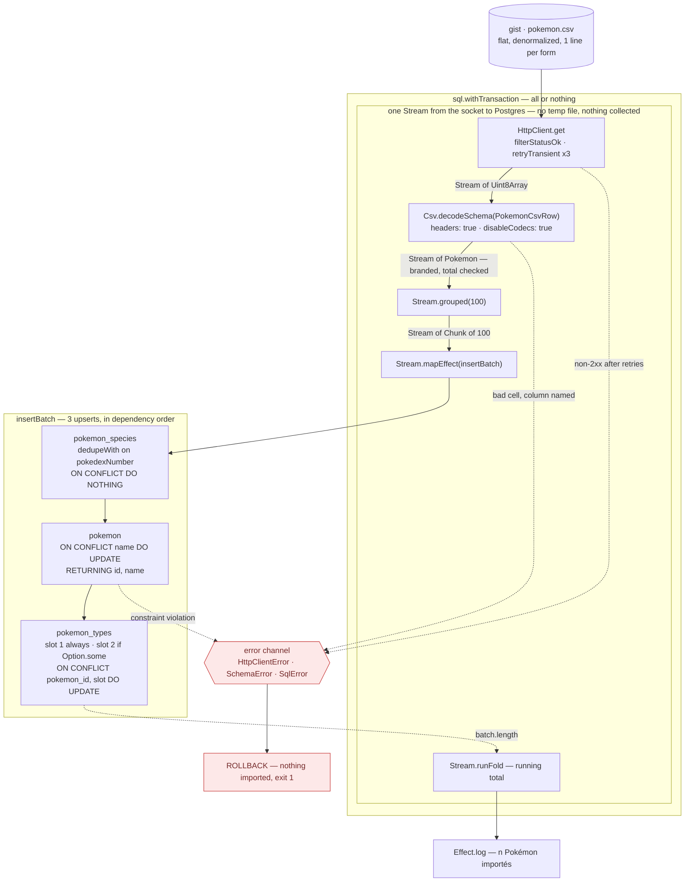
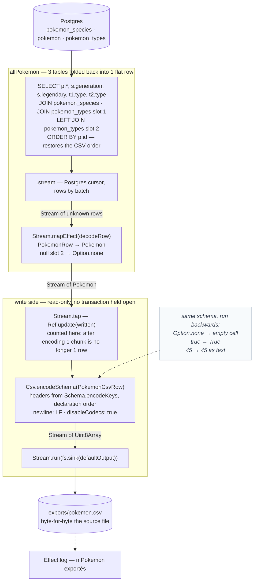

# Import / Export — Mermaid diagrams for the article

## 1. Import

```mermaid
flowchart TD
    SRC[("gist · pokemon.csv<br/>flat, denormalized, 1 line per form")]

    subgraph TX["sql.withTransaction — all or nothing"]
        subgraph PIPE["one Stream from the socket to Postgres — no temp file, nothing collected"]
            direction TB
            HTTP["HttpClient.get<br/>filterStatusOk · retryTransient x3"]
            DECODE["Csv.decodeSchema(PokemonCsvRow)<br/>headers: true · disableCodecs: true"]
            GROUP["Stream.grouped(100)"]
            WRITE["Stream.mapEffect(insertBatch)"]
            FOLD["Stream.runFold — running total"]
        end
    end

    subgraph REPO["insertBatch — 3 upserts, in dependency order"]
        direction TB
        T1["pokemon_species<br/>dedupeWith on pokedexNumber<br/>ON CONFLICT DO NOTHING"]
        T2["pokemon<br/>ON CONFLICT name DO UPDATE<br/>RETURNING id, name"]
        T3["pokemon_types<br/>slot 1 always · slot 2 if Option.some<br/>ON CONFLICT pokemon_id, slot DO UPDATE"]
        T1 --> T2 --> T3
    end

    ERR{{"error channel<br/>HttpClientError · SchemaError · SqlError"}}
    RB["ROLLBACK — nothing imported, exit 1"]

    SRC --> HTTP
    HTTP -->|"Stream of Uint8Array"| DECODE
    DECODE -->|"Stream of Pokemon — branded, total checked"| GROUP
    GROUP -->|"Stream of Chunk of 100"| WRITE
    WRITE --> T1
    T3 -.->|"batch.length"| FOLD
    FOLD --> LOG["Effect.log — n Pokémon importés"]

    HTTP -.->|"non-2xx after retries"| ERR
    DECODE -.->|"bad cell, column named"| ERR
    T2 -.->|"constraint violation"| ERR
    ERR --> RB

    classDef err fill:#fde8e8,stroke:#c53030,color:#742a2a
    class ERR,RB err
```

## 2. Export

```mermaid
flowchart TD
    DB[("Postgres<br/>pokemon_species · pokemon · pokemon_types")]

    subgraph READ["allPokemon — 3 tables folded back into 1 flat row"]
        direction TB
        SQL["SELECT p.*, s.generation, s.legendary, t1.type, t2.type<br/>JOIN pokemon_species · JOIN pokemon_types slot 1<br/>LEFT JOIN pokemon_types slot 2<br/>ORDER BY p.id — restores the CSV order"]
        CURSOR[".stream — Postgres cursor, rows by batch"]
        DECROW["Stream.mapEffect(decodeRow)<br/>PokemonRow → Pokemon<br/>null slot 2 → Option.none"]
    end

    subgraph OUT["write side — read-only, no transaction held open"]
        direction TB
        TAP["Stream.tap — Ref.update(written)<br/>counted here: after encoding 1 chunk is no longer 1 row"]
        ENCODE["Csv.encodeSchema(PokemonCsvRow)<br/>headers from Schema.encodeKeys, declaration order<br/>newline: LF · disableCodecs: true"]
        SINK["Stream.run(fs.sink(defaultOutput))"]
    end

    CELLS["same schema, run backwards:<br/>Option.none → empty cell<br/>true → True<br/>45 → 45 as text"]

    FILE[("exports/pokemon.csv<br/>byte-for-byte the source file")]

    DB --> SQL
    SQL --> CURSOR
    CURSOR -->|"Stream of unknown rows"| DECROW
    DECROW -->|"Stream of Pokemon"| TAP
    TAP --> ENCODE
    CELLS -.-> ENCODE
    ENCODE -->|"Stream of Uint8Array"| SINK
    SINK --> FILE
    FILE -.-> LOG["Effect.log — n Pokémon exportés"]

    classDef note fill:#f7fafc,stroke:#a0aec0,color:#2d3748,font-style:italic
    class CELLS note
```
